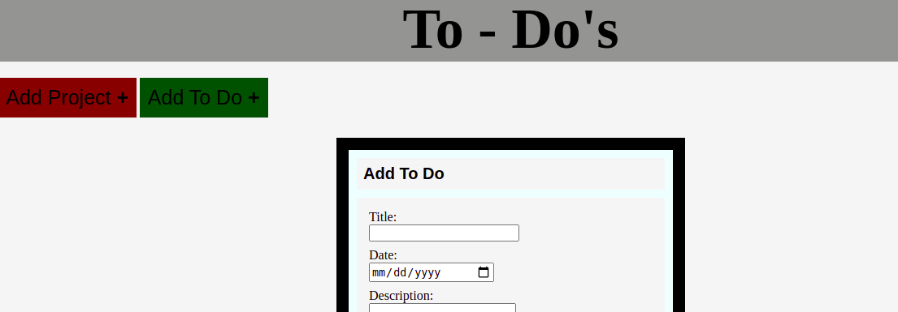

## CHECK LIST

⚠️ I am allowed by Microverse to make this Project Solo ⚠️

> A Javascript Web Application to manage your list of tasks. Applying concepts about OOP, ES6 resources and Functional Programming.

### You can access a Live Demo [HERE](https://rawcdn.githack.com/atenaiis/Todo-list/b6e20c0c36dbf2930b9e2d1a0c29fdcfa9f99035/dist/index.html)

## Features

- User can create Projects (A Default Project is automatically created)
- User can create a 'ToDo' and choose what Project it should belong to
- The main page display all the Projects separated and its 'To Do's
- User can expand a 'To Do' to view its details or edit it

## Built With

- Javascript
- Webpack
- HTML5
- CSS3
-Bootstrap

## Getting Started

To get a local copy of this project running follow these simple steps.

- Clone this repository
 > `git clone  git@github.com:atenaiis/Todo-list.git
- Navigate to the Repo Folder
- To set Webpack and the dependencies run the command
> `npm install`
- Use your favorite browser to open the index.html file (located at the dist page)
## Running tests

This project contains Built tests using jest. To run the tests on your local machine you can run the following command on the project folder:
 > `yarn test`

 If you want to build customized tests, you should create new files or edit the files inside the tests/ folder.
 The tests files should be always named with the extension .test.js
 To set the watch mode and keep tracking the tests continuously while you build it you can run
> `yarn test-watch`

## Authors

👤 **Atenais Campos**

- Github: [@atenaiis](https://github.com/atenaiis)
- Twitter: [@spranomarian](https://twitter.com/SopranoMarian)
- Linkedin: [linkedin](https://www.linkedin.com/in/mariana-atenai-campos-garcia-a30791143/)

## 🤝 Contributing

Contributions, issues and feature requests are welcome!

Feel free to check the [issues page](issues/).

## Show your support

Give a ⭐️ if you like this project!

## 📝 License

MIT